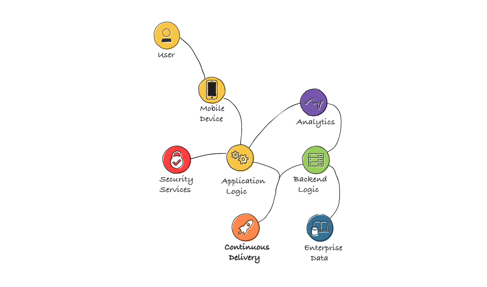
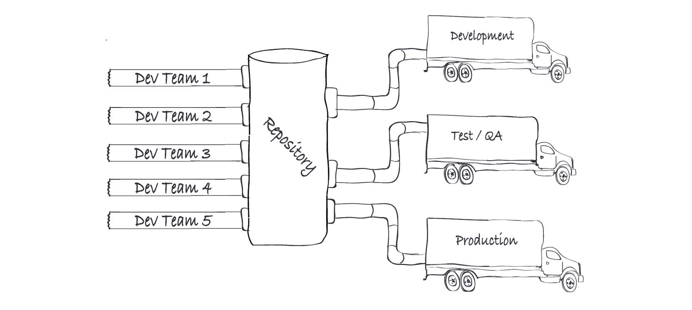

---

copyright:
  years: 2016, 2017, 2018
lastupdated: "2018-03-16"

---
{:new_window: target="_blank"}
{:shortdesc: .shortdesc}
{:screen: .screen}
{:codeblock: .codeblock}
{:pre: .pre}
{:tip: .tip}

# Explore the developer journey in {{site.data.keyword.cloud_notm}}
{: #dev-journey}

As a developer, {{site.data.keyword.cloud}} has a set of capabilities that gets you started building apps in minutes. Within our developer dashboards you can:

* Select starter kits that are use-case-specific and produce production-ready starter apps in a variety of programming languages and architectural patterns
* Provision services automatically as part of the project creation of your starter kit
* Use a portable app project structure that allows you manage components of your app
* One-click creation of a [DevOps toolchain](../services/ContinuousDelivery/index.html#cd_getting_started).
* Use a [command line interface](/docs/cli/idt/index.html) for local development

To understand how the {{site.data.keyword.cloud_notm}} developer experience can help you rapidly build high-quality production-ready apps, let's look at these elements in more detail.

## Developer dashboards
{: #dev-dashboards}

The {{site.data.keyword.cloud_notm}} has developer dashboards in different areas of interest (like Watson, Security, or Finance) or a digital channel (like Mobile or Web Apps). You can access these dashboards from the **Menu icon  .

Each developer dashboard provides starter kits relevant to the dashboard's focus area and offers a consistent, intuitive workflow then enables you to create a working production-ready app in minutes.

## App projects
{: #app-projects}

A project is the association of code, data, services, and toolchains that comprise your app. For example, the {{site.data.keyword.cloud_notm}} mobile project contains code for application and back-end logic, data storage, analytics and security services, and is set up for continuous delivery.

You can create and manage a project by using any {{site.data.keyword.cloud_notm}} developer dashboard or the {{site.data.keyword.dev_cli_notm}}.

## Starter kits
{: #starter-kits}

With starter kits, {{site.data.keyword.cloud_notm}} assembles a skeleton production app, in the language of your choice, ready for cloud deployment. Each starter kit includes a language, a framework, and a pattern for a specific use case and enables you to reuse code.

### How are starter kits different from samples?
Starter kits are production-ready and focus on demonstrating a key pattern implementation using a runtime (for example Node.js and Express). In some cases, starter kits offer a simple user experience to highlight the integration of the service. In other cases stater kits represent a customizable implementation of a sophisticated use case.

* A **snippet** is a few lines of code that is often presented in an IDE. Snippets help a developer integrate with a programming language syntax or support integration with a defined API.
* A **demo** is usually high in quality and fidelity and uses a range of services and integration points. It often requires setup time and is used to prove a business problem or demonstrate a platform feature. It’s used for evaluating stages of cloud adoption. Sometimes its code included in production code.
* A **sample** is a small example of a specific feature, function, service, or user journey. A sample can be reused or included in a production application. It’s typically used to show technical capabilities and a possible approach to solving a technical problem.
* **starter kit** is a production-ready pattern that can be integrated with a set of services to generate a production-ready asset that can be deployed directly into a DevOps pipeline and a Kubernetes cluster. A starter kit contains descriptive metadata providing the user with enough information to know what the kit is and does. It also contains instructions that tell {{site.data.keyword.cloud_notm}} what to produce. The output is production-ready out of the box, and can be iterated on for further enhancements, based on IBM best practices. Starter kit content isn’t as complex as a demonstration and not as trivial as a snippet or sample. They are dynamically created based on the developer’s requirements.

## Auto-provisioned resources
{: #auto-provision}

If a starter kit specifies required resources, {{site.data.keyword.cloud_notm}} automatically creates instances of those resources when you create your project. Note that you can also manually provision resources or select existing resource instances to add to your project after it’s created. You can see a list of service instances associated with your project in the Project Details view along with credentials in case you need them.

## Portable code
{: #portable-code}

Creating an app from a starter kit automatically creates code for you that has consistent format and is runtime agnostic. You can deploy the code into your environment of choice, for example Kubernetes or Cloud Foundry, without making changes.

### What code is created?
The code created from an {{site.data.keyword.cloud_notm}} starter kit has four fundamental components: use case logic, language components, service enablement, and cloud enablement. Generating these components saves you valuable time and ensures you’re using best-in-class architecture.

* **Use case logic** provides functions for the core function of a particular use case. Examples might be code for a Watson Conversation chat bot, or code for a mobile visual recognition app.
* **Language components** are code components and files specific to the programming language you select for your starter kit. For example, node.js programmers will need a package.json file for dependency management, and this file is automatically created for you.
* **Service enablement** is code that enables your app to connect to and use the services you add to your project. Credential management, initialization code, and service-specific SDKs are examples of service enablement items.
* **Cloud enablement** is code that enables your app to run on {{site.data.keyword.cloud_notm}}. For example, Helm charts that enable your app to run on an {{site.data.keyword.cloud_notm}} Kubernetes cluster.

The app produced by {{site.data.keyword.cloud_notm}} isn’t only architecturally proven, but it also reflects best practices for the language you chose for your project.  

The project includes a readme file that contains technical details of the project and explains what is needed to get your app running if it doesn’t run out-of-the-box.
{: tip}

## DevOps Toolchain
{: #devops}

DevOps comprises procedures and tools for accessing, developing, deploying, and operating your app. A DevOps toolchain is set of linked services that automate your DevOps tasks. It’s possible to perform DevOps manually with very simple apps, but the need for automation increases quickly as app complexity increases, and toolchain automation is a must-have for continuous delivery.

The core component of a DevOps toolchain is a code version control repository like GitHub. Additional tools might include backlog tracking, delivery pipeline, IDE, and monitoring service like [{{site.data.keyword.cloud_notm}}DevOps Insights](../services/DevOpsInsights/index.html#gettingstarted).

If you have created a project by using a starter kit, you can create a new toolchain and deploy your app simply by clicking **Deploy to Cloud** in the Project Details view. A toolchain that has a code repo, issues repo, delivery pipeline, and web IDE is created.

You can then build on this toolchain to accommodate multiple teams and deploy to separate environments for development, test, and production and establish an enterprise-class collaborative continuous delivery model for your app.  

You can also get a quick look at your project code by clicking the **Download** button on the project overview page of the developer dashboard. Your code is downloaded as a `.zip` file containing the complete project structure. You can easily extract the file and run the code locally by using the {{site.data.keyword.dev_cli_notm}}, or add it to your code management repository.

## Command line interface
{{site.data.keyword.dev_cli_notm}} enables you to code, build and run your project locally.  A common pattern is to create your project through a developer dashboard, use {{site.data.keyword.dev_cli_notm}} to develop locally, and then push the updates to your repo and merge to start your deployment toolchain.

## Garage Method development
{: #developer_concepts}

Check out the [Garage Method](https://www.ibm.com/cloud/garage/) to learn how IBM can help you develop apps in your organization.  

*Garage Method phases overview*

{{site.data.keyword.cloud_notm}} helps you produce successful enterprise-class production apps by using the Garage Method or whatever method you prefer. To better understand what {{site.data.keyword.cloud_notm}} has to offer developers, let's take a quick look at the skills required to build a modern app.

## Developer skills
{: #skills}

Today users expect more from their applications than ever before. They want apps to deliver deep insights from stored and real-time data, to be always-available, and to match their individual needs more closely. To meet these expectations, app creators need to bring together many different skill sets. For example, a sophisticated cognitive application might require contributions from digital developers, cloud native developers, streams developers, data scientists, and DevOps specialists.

 

* **Digital developers** author for a particular digital channel such as mobile web, voice, and chat. Digital developers are typically focused on use cases and directly meeting users' needs as a comprehensive experience.
* **Cloud native developers** specialize in constructing and interconnecting cloud components. Microservice and back-end-for-frontend authors fall into this category.
* **Streams developers** focus on processing and gaining insight from streams of data. For example, a streams developer might analyze and initiate action on incoming text, speech, or video streams.
* **Data scientists** use analytics and machine learning to produce predictive models. These models are used in business metrics and provide deep insights to application users.
* **DevOps specialists** are experts in resolving deployment and toolchain issues. For simple apps, dedicated specialists are usually not needed as development team members manage DevOps with the squad. But for complex enterprise applications, with many dependencies, DevOps specialists are essential in keeping your production app running smoothly.

The developer capabilities built in to {{site.data.keyword.cloud_notm}} align to these skill sets and allow your team to use one platform to produce, deliver, run, and manage your app. For example, a digital developer creating a mobile app might use the {{site.data.keyword.cloud_notm}} [Mobile developer dashboard](https://console.bluemix.net/developer/mobile/dashboard), a cognitive app builder might use the [Watson developer dashboard](https://console.bluemix.net/developer/watson/dashboard) along with [Watson Studio](https://console.bluemix.net/catalog/services/watson-studio), a streams developer can use [IBM Real-Time Analytics](../services/StreamingAnalytics/index.html#gettingstarted), and the [{{site.data.keyword.cloud_notm}} Continuous Delivery service](../services/ContinuousDelivery/index.html#cd_getting_started) simplifies the job of a DevOps specialist.

Ready to get started? [Click here](../apps/index.html) to build an app on {{site.data.keyword.cloud_notm}} now!