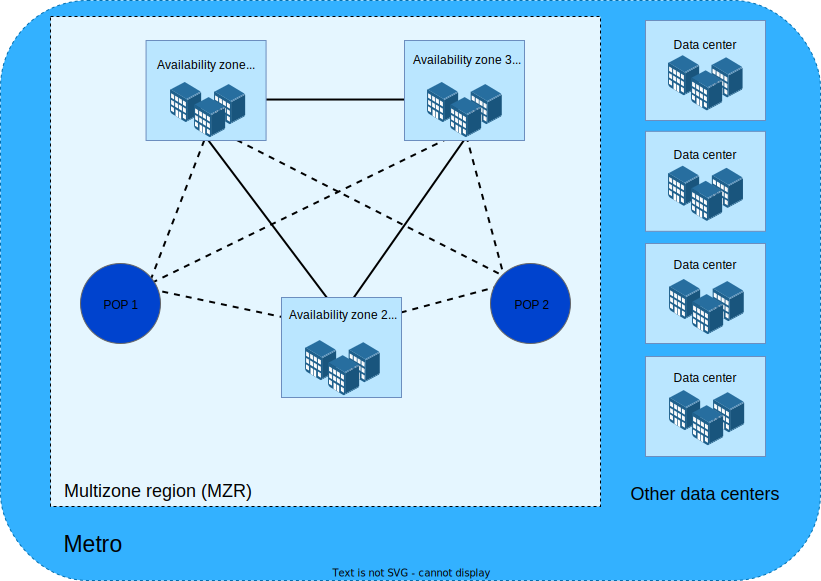

---

copyright:
  years: 2019, 2022
lastupdated: "2022-04-20"

keywords: data centers, datacenter, regions, locations, ibm cloud regions, multizone regions, MZRs, cloud regions, cloud data centers, multizone, geo, availability zone, zones

subcollection: overview

---

{{site.data.keyword.attribute-definition-list}}

# Region and data center locations for resource deployment
{: #locations}

{{site.data.keyword.cloud}} has a resilient global network of locations to host your highly available cloud workload. You can create resources in different locations, such as a region or data center, but with the same billing and usage view. You can also deploy your apps to the location that is nearest to your customers to achieve low application latency. {{site.data.keyword.cloud_notm}} provides three tiers of regions: [multizone regions](#x9774820){: term}, [single-campus multizone regions](#x10127487){: term}, and [data centers](#x2439906){: term}. 
{: shortdesc}

## Regions
{: #regions}

Multizone regions (MZRs) are composed of three or more zones that are independent from each other to ensure that single failure events affect only a single zone. MZRs provide low latency (< 2-milliseconds latency) and high bandwidth (> 1000 Gbps) connectivity across zones. For [GA](#x2117947){: term} service rollout, see the [Service rollout policy](/docs/overview?topic=overview-service-rollout). 

The advantage of an MZR is that it provides consistent cloud services across different zones, better resiliency, availability, higher interconnect speed between data centers for your resources. These features can be critical to your applications. Deploying the application in an MZR rather than a different deployment location (data centers, either physical or logical) is that you can increase the availability from 99.9% to 99.99% when deployed over three zones. 

{{site.data.keyword.IBM}} offers two types of multizone regions. The underlying infrastructure in both types provides the same SLA. 

### Multizone regions (MZR)
{: #table-mzr}

MZRs offer the highest level of redundancy and availability because it uses three separate sites within a region.

{: caption="Figure 1. Multizone region (MZR)" caption-side="bottom"}

The following table lists the {{site.data.keyword.cloud_notm}} MZRs that fall into this category and the region, zone, and data center codes for each one. 

| Location | Region | Zone | Data center |
|-----------|----------|------|----|
| Dallas | us-south | us-south-1  \n us-south-2  \n us-south-3 | DAL10  \n DAL12  \n DAL13 |
| Sao Paulo | br-sao | br-sao-1  \n br-sao-2  \n br-sao-3 | SAO01  \n SAO04  \n SAO05 |
| Toronto | ca-tor | ca-tor-1  \n ca-tor-2  \n ca-tor-3 | TOR01  \n TOR04  \n TOR05 |
| Washington DC | us-east | us-east-1  \n us-east-2  \n us-east-3 | WDC04  \n WDC06  \n WDC07 |
{: caption="Table 1. MZRs in North and South America" caption-side="top"}
{: #americas-mzr}
{: tab-title="Americas"}
{: tab-group="mzr"}
{: class="simple-tab-table"}
{: summary="Use the buttons before the table to change the context of the table. The column headers identify the data centers located in the specific geographical area."}

| Location      | Region   | Zone | Data center |
|-----------|----------|------|----|
| Frankfurt     | eu-de    |eu-de-1  \n eu-de-2  \n eu-de-3 | FRA02  \n FRA04  \n FRA05 |
| London        | eu-gb    |eu-gb-1  \n eu-gb-2  \n eu-gb-3 | LON04  \n LON05  \n LON06|
{: caption="Table 1. MZRs in Europe" caption-side="top"}
{: #europe-mzr}
{: tab-title="Europe"}
{: tab-group="mzr"}
{: class="simple-tab-table"}
{: summary="Use the buttons before the table to change the context of the table. The column headers identify the data centers located in the specific geographical area."}

| Location      | Region   | Zone | Data center |
|-----------|----------|------|----|
| Sydney        | au-syd   |au-syd-1  \n au-syd-2  \n au-syd-3 | SYD01  \n SYD04  \n SYD05|
| Tokyo         | jp-tok   |jp-tok-1  \n jp-tok-2  \n jp-tok-3 | TOK02  \n TOK04  \n TOK05|
{: caption="Table 1. MZRs in Asia Pacific" caption-side="top"}
{: #asiapacific-mzr}
{: tab-title="Asia Pacific"}
{: tab-group="mzr"}
{: class="simple-tab-table"}
{: summary="Use the buttons before the table to change the context of the table. The column headers identify the data centers located in the specific geographical area."}

### Single campus MZRs
{: #single-campus-mzr}

Single campus MZRs contain three availability zones in different sections of the same building or within multiple buildings on a campus where the power, cooling, networking, and physical security dependencies overlap but are not identical between any two availability zones. This setup ensures a level of continuous availability and survivability of any one system outage, planned or unplanned.

SLAs are maintained because the infrastructure is set up in a concurrently maintainable fashion so that a single failure does not affect all three zones in the same campus. This setup is ideal for services that support local users as it reduces latency or to support disaster recovery workloads.

{: caption="Figure 2. Single campus MZR" caption-side="bottom"}

The following table lists the single campus MZRs that are available in {{site.data.keyword.cloud_notm}} and the region, zone, and data center codes for each one.

| Location      | Region   | Zone | Data center |
|-----------|----------|------|----|
| Osaka         | jp-osa   |jp-osa-1  \n jp-osa-2  \n jp-osa-3 | OSA21  \n OSA22  \n OSA23|
{: caption="Table 2. Single campus MZRs" caption-side="top"}

## Data centers
{: #data-centers}

In addition to selecting a region for your resource, you can select from a list of the {{site.data.keyword.Bluemix_notm}} data centers, depending on the type of resource you're working with. 

Data centers host the power, cooling, compute, network, and storage resources used for services and apps. They don't provide isolation from multizones in a location. 

Data centers are based on a POD architecture where each data center can have more than one POD, depending on the on-demand build out. Each POD consists of racks, servers, networks, and storage, along with backup power generators. Placing application servers across PODs improves the availability.

{: caption="Figure 3. MZR and data center locations map" caption-side="bottom"}

See the following table for the specific code for each data center.

| Data center      | Code  |
|------------------|-------|
| Dallas 05        | DAL05 |
| Dallas 06 [^tabletext2]       | DAL06 |
| Dallas 08 [^tabletext3]    | DAL08 |
| Dallas 09        | DAL09 |
| Dallas 10        | DAL10 |
| Dallas 12        | DAL12 |
| Dallas 13        | DAL13 |
| Mexico 01        | MEX01 |
| Montreal 01      | MON01 |
| San Jose 01      | SJC01 |
| San Jose 03      | SJC03 |
| San Jose 04      | SJC04 |
| Sao Paulo 01     | SAO01 |
| Sao Paulo 04     | SAO04 |
| Sao Paulo 05     | SAO05 |
| Toronto 01       | TOR01 |
| Toronto 04       | TOR04 |
| Toronto 05       | TOR05 |
| Washington DC 01 | WDC01 |
| Washington DC 03 [^tabletext4] | WDC03 |
| Washington DC 04 | WDC04 |
| Washington DC 06 | WDC06 |
| Washington DC 07 | WDC07 |
{: caption="Table 3. Data centers in North and South America" caption-side="top"}
{: #americas}
{: tab-title="Americas"}
{: tab-group="dcs"}
{: class="simple-tab-table"}
{: summary="Use the buttons before the table to change the context of the table. The column headers identify the data centers located in the specific geographical area."}

[^tabletext2]: Closing in 2022 [Learn more](/docs/get-support?topic=get-support-dc-closure)

[^tabletext3]: IBM Cloud for Government [Learn more](https://www.ibm.com/cloud/government)

[^tabletext4]: IBM Cloud for Government [Learn more](https://www.ibm.com/cloud/government)

| Data center  | Code  |
|--------------|-------|
|Amsterdam 01 [^tabletext5] | AMS01|
|Amsterdam 03 | AMS03|
|Frankfurt 02 | FRA02|
|Frankfurt 04 | FRA04|
|Frankfurt 05 | FRA05|
|London 02 | LON02|
|London 04 | LON04|
|London 05 | LON05|
|London 06 | LON06|
|Milan 01 | MIL01|
|Paris 01 | PAR01|
{: caption="Table 3. Data centers in Europe" caption-side="top"}
{: #europe}
{: tab-title="Europe"}
{: tab-group="dcs"}
{: class="simple-tab-table"}
{: summary="Use the buttons before the table to change the context of the table. The column headers identify the data centers located in the specific geographical area."}

[^tabletext5]: Closing in 2022 [Learn more](/docs/get-support?topic=get-support-dc-closure)

| Data center  | Code  |
|--------------|-------|
|Chennai 01 | CHE01|
|Hong Kong 02 [^tabletext6] | HKG02|
|Osaka 21 | OSA21|
|Osaka 22 | OSA22|
|Osaka 23 | OSA23|
|Seoul 01 [^tabletext7] | SEO01|
|Singapore 01 | SNG01|
|Sydney 01 | SYD01|
|Sydney 04 | SYD04|
|Sydney 05 | SYD05|
|Tokyo 02 | TOK02|
|Tokyo 04 | TOK04|
|Tokyo 05 | TOK05|
{: caption="Table 4. Data centers in Asia Pacific" caption-side="top"}
{: #asiapacific}
{: tab-title="Asia Pacific"}
{: tab-group="dcs"}
{: class="simple-tab-table"}
{: summary="Use the buttons before the table to change the context of the table. The column headers identify the data centers located in the specific geographical area."}

[^tabletext6]: Closing in 2022 [Learn more](/docs/get-support?topic=get-support-dc-closure)

[^tabletext7]: Closing in 2022 [Learn more](/docs/get-support?topic=get-support-dc-closure)

The table includes certain data centers that are set to close soon. For the list of data centers that are closing, see [Data center closures](/docs/get-support?topic=get-support-dc-closure).
{: note}

## Viewing resources by location
{: #filter-location}

You can view all resources and locations from the Resource list page in the console. If you want to view and work with resources in a specific location, expand the **Location** filter, and select a location from the list. By expanding a specific location, you can select to filter by individual data centers, regions, or zones.

Depending on the type of resource, you might be interested in only specific types of location data. For example, if you created a service or VPC infrastructure service, you can filter the Resource list page by the region and zone codes. However, if you're working with classic infrastructure resources, the specific data center codes are the pertinent information for you.

For example, if you have resources that are deployed in the London 2 (eu-gb-2) zone, you can set filters to display only those resources in your resource list. Expand the **London** metro option, and the **London (eu-gb)** region option. Within that region, you can select from the list of available zones, such as **London 2 (eu-gb-2)**. If you have a classic infrastructure resource that is deployed in a specific data center, you can identify the data center by the specific metro location and alphanumeric code. For example, use **Dallas** for the metro location and then **Dallas 05 (dal05)** for the data center.

You might also want to display your resources that are located globally. The **Global** option means that only one logical, globally accessible instance of the service, independent of any region or zone, is published to customer applications. These types of resources are accessible from a global endpoint.

As illustrated in the following graphic, a data center is a physical building that represents an availability zone that is located within a multizone region (MZR). An MZR is organized by its metro location. For example, London can encompass more than one grouping of data centers within an MZR. The graphic shows three availability zones in one MZR that work together in the instance that one of the data centers becomes unavailable. Availability zones are connected directly to each or through low latency links.

{: caption="Figure 4. Location hierarchy" caption-side="bottom"}
