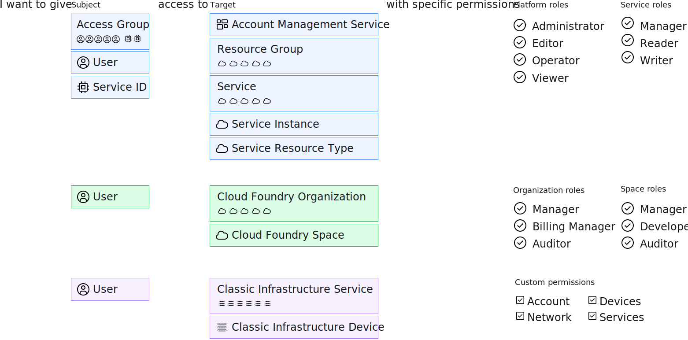

---

copyright:

  years: 2017, 2019

lastupdated: "2018-04-02"

keywords: users level of access, user control, access control, permissions

subcollection: overview

---

{:shortdesc: .shortdesc}
{:codeblock: .codeblock}
{:screen: .screen}
{:new_window: target="_blank"}

# Managing access in {{site.data.keyword.Bluemix_notm}}
{: #cloudaccess}

Access management enables you to control which users see, create, use, and manage resources in your account. To grant access, you can assign roles that allow users levels of access for completing platform management tasks and accessing account resources.
{: shortdesc}

The way that you manage access in {{site.data.keyword.Bluemix}} depends on the type of resource that you want to assign access to. {{site.data.keyword.Bluemix_notm}} Identity and Access Management (IAM) is the access management system that is used for consistently managing resources that are organized in a resource group across the {{site.data.keyword.Bluemix_notm}} platform. Classic infrastructure and Cloud Foundry resources are not managed by using Cloud IAM. These resource types have their own access management systems. 

If you have a combination of resource types, you manage each type separately:

* For IAM resources, go to **Manage** &gt; **Access (IAM)**, and then select **Users**, **Access groups**, or **Service IDs** to get started.
* For assigning access to your [classic infrastructure resources](/docs/iam?topic=iam-infrapermission), you set permissions within **Manage** > **Access (IAM)** on the Classic infrastructure tab for the user that you want to assign access. 
* For assigning access to [Cloud Foundry resources](/docs/iam?topic=iam-cfaccess), you assign users to orgs and set Cloud Foundry org and space access roles within **Manage** > **Access (IAM)** on the Cloud Foundry tab for the user.

While each type of access is managed separately, all access policies are made up of a subject you want to assign access to, a target for the policy to scope what the subject has access to, and then finally an IAM role, Cloud Foundry role, or classic infrastructure permission to determine the level of access the subject has on the target.

For IAM policies, the subject can be an access group, user, or service ID. And, the target can be an account management service, resource group, service in the account, specific service instance, or resource type within a service. Platform and service roles can be selected to scope the level of access for the subject. For Cloud Foundry access, a user is given access to a Cloud Foundry org and space by selecting each and assigning an org role and space role. For classic infrastructure, a user is selected, and then the access can be scoped to a service or device with specific permissions assigned.

## Permissions for managing access
{: #perms-manageaccess}

As an account owner, you can manage access to all resources in your account. You can also delegate the task of managing access to platform resources by assigning a user in your account the administrator role for all services, just the specific service, or the resource group that you want that user to manage.

If you have Cloud Foundry services in your account, you can assign another user the organization or space manager role in order for them to add users and assign Cloud Foundry roles for accessing instances in the organization or space that they manage.

## Getting started
{: #cloudaccess-getstarted}

Go to **Manage** &gt; **Access (IAM)**, and then select **Users** to start managing access for users in your account. Select a user from the list to get started. You see only the access management options that you have permission to manage. For example, if you are not the account owner and you are not an organization or space manager, you do not see the option to manage Cloud Foundry access.

You can also assign access roles to apps and services by using service IDs. Go to the **Service IDs** page to get started. For more information about how to get up and running quickly with {{site.data.keyword.Bluemix_notm}} IAM, see the [Getting started tutorial](/docs/iam?topic=iam-getstarted).
