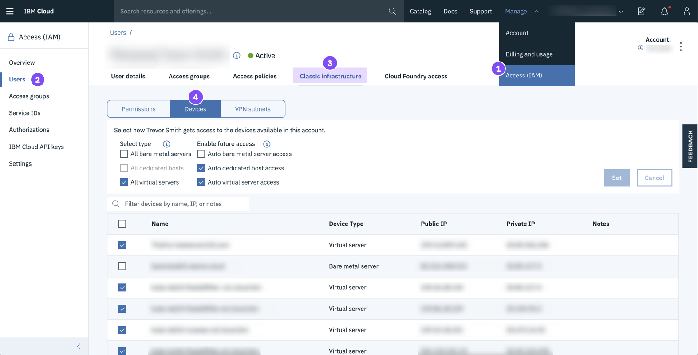
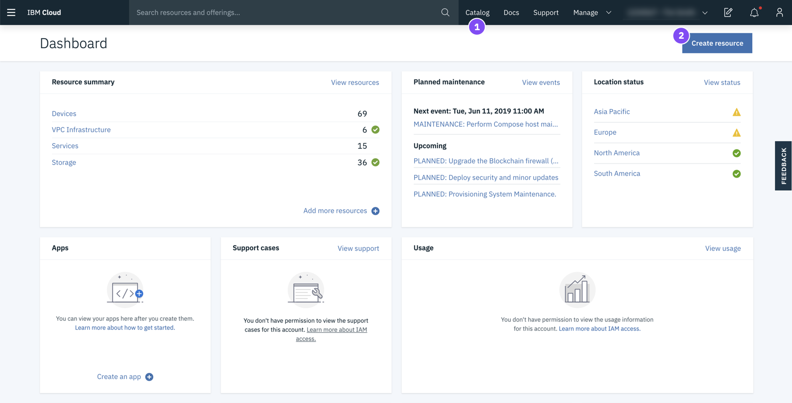
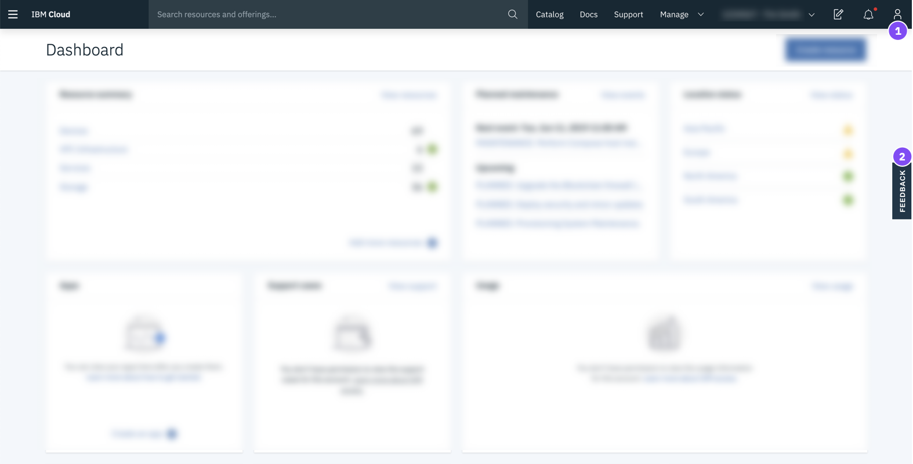
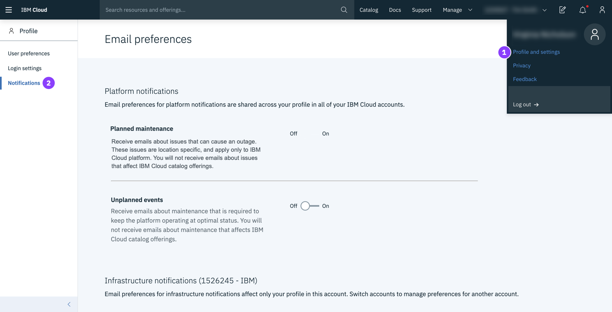

---

copyright:
  years: 2015, 2020
lastupdated: "2020-07-10"

keywords: ui, components, using the console, SoftLayer, classic infrastructure, redirect, catalog, pricing information, get support, dashboard, scoped dashboard

subcollection: overview

---

{:shortdesc: .shortdesc}
{:tip: .tip}
{:note: .note}
{:external: target="_blank" .external}
{:script: data-hd-video='script'}

# Navigating the {{site.data.keyword.cloud_notm}} console 
{: #ui}

The {{site.data.keyword.cloud}} console is a user interface that helps you manage all your {{site.data.keyword.cloud_notm}} resources. When you access the [console](https://cloud.ibm.com){: external} , you can create a free account, log in, access documentation, access the catalog, view pricing information, get support, or check the status of {{site.data.keyword.cloud_notm}} components. After you log in, the menu bar contains a Menu icon  and more links.
{: shortdesc}

## Watch a tour
{: #video-ui}

  <iframe class="embed-responsive-item" id="youtubeplayer" title="Welcome to IBM Cloud" type="text/html" width="640" height="360" src="https://www.youtube.com/embed/VXqbRNwXC2A" frameborder="0" webkitallowfullscreen mozallowfullscreen allowfullscreen> </iframe>

## Video transcript
{: #video-transcript-ui}
{: script}
{: notoc}

Welcome to IBM Cloud, the home of over 190 unique services that are available for you to start customizing and building the solutions that you need for your business today! [Upbeat music]

After logging in, you're ready to start building right away! From your dashboard, pick the journey that best fits your needs [Click Menu icon > Dashboard]. Start creating apps, add users to your account, or if you wanted to learn about some of our common patterns based on best practices and proven technologies, check out the solution tutorials in the Learn widget. Your dashboard is the place to view a high-level overview of your account usage, support cases, apps, and resources with quick links out to each area.

When you're ready to start adding resources to your account, go to the catalog [Click Catalog menu item]. Get started with some powerful services from Watson in the AI category. Check out our databases, IoT, networking, and storage offerings. And explore the variety of compute options from the IBM Cloud Kubernetes Service to bare metal servers to serverless. If you're just here to try us out, filter the catalog to view offerings with Lite plans, which are free to use [Click Filter to expand the options, and select Lite].

After you start building, go to the My resources page [Click Menu icon > My resources] to get a quick and easy view of all of the resources that have been added to your account. This is where you can access quick options [Expand any category on the My resources page, and select the Actions menu icon for any row to display the options] for working with apps, and tag, rename, or delete resources.

For any of the housekeeping items that you need to take care of as the account owner, such as creating and managing your resource groups, Cloud Foundry orgs and spaces, tags for resources, or account settings, go to Manage > Account [Click Manage menu option > Account].

From the same Manage menu, you can access the Billing and usage area of your account too [Click Manage menu option > Billing and usage]. 

Through the Manage > Access (IAM) option [Click Manage menu item > Access (IAM)], you can invite users to your account and manage their access to account resources including IAM-enabled resources, Cloud Foundry resources, and classic infrastructure resources.

If you run into any questions as you start building apps, working with users, or building your infrastructure, you can visit the Support page [Click Support menu option] where you'll find common FAQs that can help you to resolve your issue quickly without even having to contact IBM Cloud. However, if you do find the need to get in touch with us or open a support case, those options are also available to you.

The docs [Click Docs menu items] are also a helpful guide for walking you through common tasks. You can enter any set of keywords in the docs search bar to help you quickly find the information that you're looking for. 

Now that you know how to navigate through the IBM Cloud console to set up your account, create resources from the catalog, manage them from the My resources page, and find help through support and docs, it's time to get coding and building out your infrastructure!  

## Using the console
{: #consoleoptions}

When you log in to {{site.data.keyword.cloud_notm}}, your dashboard is displayed, which shows widgets that summarize the status of your account. If you're interested in customizing your dashboard, see [Working with scoped dashboards](/docs/account?topic=account-custom-dashboard).

  * Use the **Catalog** link to create new resources.
  * Use the **Docs** link to access the product documentation. 
  * Use the **Support** link to access the Support Center.  
  * From the **Manage** menu, you can access your account, billing and usage, and Identity and Access Management options.
  * Click the {{site.data.keyword.cloud-shell_notm}} icon  to open a browser-based shell environment that you can use to work with your {{site.data.keyword.cloud_notm}} resources.
  * Click the Cost estimator icon  to open the cost estimator.
  * Click the Notifications icon  to view and control all incidents, maintenance, and announcements that are likely to affect your account.

## Searching for resources
{: #search}

You can search for resources by name or by tag from anywhere in the {{site.data.keyword.cloud_notm}} console for resources that you expect to find in the My resources page. Type the name of a resource or tag in the search field in the console menu bar.

For more information, see [Searching for resources](/docs/resources?topic=resources-searching-for-resources). 

## Managing resources
{: #dashboardview}

Go to the Menu icon  &gt; **Resource List** to access your list of account resources. You can use the My resources page to view and work with {{site.data.keyword.cloud_notm}} resources and Cloud Foundry service instances. See [What is a resource?](/docs/resources?topic=resources-resource) for more information about the different types of resources.

### Viewing resources
You can view all the resources in your account across all locations from the My resources page. To see the items that are important to you, filter your list with the filters for each column header. For example, if you want to view and work with resources in a specific location, expand the **Location** filter, and select a location from the list.

### Working with resources
You can work with your resources in various ways from the My resources page:

  * Each resource is displayed in its own row and an Actions icon  is included at the end of the row. Click the Actions icon  to start, stop, rename, or delete a resource.
  * To set up credentials or connections for a resource, click the name of the resource to navigate to the resource details page. Then, select **Service credentials** or **Connections**. For more information, see [Adding a credential](/docs/resources?topic=resources-service_credentials) and [Managing connections](/docs/resources?topic=resources-connect_app).
 

## Working in the catalog
{: #catalogcreate}

Click **Catalog** from the console menu bar to explore the available offerings, which are organized in the following categories: 

* From the Services tab, you can explore the {{site.data.keyword.cloud_notm}} services for infrastructure, developer tools, compute, AI, and more for building your apps on the public cloud. The lifecycle and operations of these services are managed by {{site.data.keyword.IBM_notm}}.
* From the Software tab, you can find Cloud Paks, Bitnami Helm charts, and Terraform templates. The preconfigured software solutions help you to build faster, and each offering is installed by using a simplified installation process to help you get started quickly. You manage the deployment and configuration of these offerings on your own compute resources.

You can quickly search for any specific offering by entering keywords, or you can use the categories and filters to explore the different types of offerings. You can filter by category, offering type, deployment target, or the offering provider. For example, if you want to deploy an analytics offering to {{site.data.keyword.openshiftlong}}, you can select the **Analytics** category, and then filter the results by selecting **Red Hat OpenShift** as the deployment target.

After you select the offering that you want create, you can define the deployment location.

  * For Cloud Foundry resources, you can select a specific region and then select the org and space for the service instance to be assigned to.
  * For resources managed by {{site.data.keyword.cloud_notm}} Identity and Access Management (IAM), you select a location to deploy in. Then, you select a resource group to assign the service instance to.

## Transitioning to the {{site.data.keyword.cloud_notm}} experience
{: #redirect-cloud}

As part of the migration from SoftLayer to {{site.data.keyword.cloud_notm}}, get familiar with the {{site.data.keyword.cloud_notm}} console, which you use to manage both your platform and infrastructure resources. We're currently in the process of linking all SoftLayer and {{site.data.keyword.cloud_notm}} accounts. Therefore, your account might not have access yet. As soon as it does, you can check out the new experience.

The formerly named SoftLayer is now called {{site.data.keyword.cloud_notm}} classic infrastructure.
{: note}

### Locating your infrastructure items
{: #sl-links}

Click the **Menu icon**  > **Classic Infrastructure** to quickly locate your devices, storage, network, security, and services. 

{: caption="Figure 1. Location of classic infrastructure items in the {{site.data.keyword.cloud_notm}} console" caption-side="bottom"}

You can also find your infrastructure resources by clicking any of the links that are listed in the Classic infrastructure widget on your dashboard. Go to **Menu icon**  > **Dashboard**.
{: tip}

### Managing users, access, and API keys
{: #billing-items}

You can manage users in your account, classic infrastructure access for your users, and your API keys from the Access (IAM) section of the console. 

* To invite new users, remove users, or manage a specific user's login settings, IP restrictions, VPN password, and more, go to **Manage** > **Access (IAM)**, and select **Users**.
* To start managing a user's classic infrastructure access, go to **Manage** > **Access (IAM)**, and select **Users**. For more details, see [Managing classic infrastructure access](/docs/iam?topic=iam-mngclassicinfra).
* To create and manage {{site.data.keyword.cloud_notm}} API keys or a classic infrastructure API key, go to **Manage** > **Access (IAM)**, and select **API keys**. For more information, see [Understanding API keys](/docs/iam?topic=iam-manapikey).

{: caption="Figure 2. Managing IAM items in the {{site.data.keyword.cloud_notm}} console" caption-side="bottom"}

### Placing an order
{: #place-order}

Use the catalog to place an order. You can navigate to the catalog in one of the following ways:

  * Click **Catalog** from the menu bar.
  * Click the **Menu icon**  > **My resources**. Then, click **Create resource**.

{: caption="Figure 3. Placing an order in the {{site.data.keyword.cloud_notm}} console" caption-side="bottom"}

If your account includes any discounts, the price of an offering that is displayed on the offering details page reflects the discounted price of that offering.
{: tip}

### Making a payment
{: #payments}

You can make a payment from the Billing and usage section of the console. Go to **Manage** > **Billing and usage**, and select **Payments**. 

{: caption="Figure 4. Making a payment in the {{site.data.keyword.cloud_notm}} console" caption-side="bottom"}

### Accessing your invoices
{: #invoices}

You can access your invoices from the Billing and usage section of the console. Go to **Manage** > **Billing and usage**, and select **Invoices**.

{: caption="Figure 5. Accessing your invoices in the {{site.data.keyword.cloud_notm}} console" caption-side="bottom"}

### Accessing your sales items
{: #sales}

Your device quotes and upgrades, orders, cancellations, and shipments are in the Billing and usage section of the console. Go to **Manage** > **Billing and usage**, and select **Sales**. 

{: caption="Figure 6. Accessing your sales items in the {{site.data.keyword.cloud_notm}} console" caption-side="bottom"}

### Accessing your support cases
{: #support-mng}

To access your current support cases, click **Support** > **Manage cases**. You can also access your archived cases by clicking **View archived cases**.

{: caption="Figure 7. Accessing your support cases in the {{site.data.keyword.cloud_notm}} console" caption-side="bottom"}

### Submitting feedback
{: #feedback-profile}

You can submit a rave review, a suggestion, or any other feedback. To get in touch with us, choose from the following methods:

  * Click the **Feedback** button that is located on the edge of the console page. 
  * Click the **Avatar icon**  > **Feedback**. 

{: caption="Figure 8. Submitting feedback in the {{site.data.keyword.cloud_notm}} console" caption-side="bottom"}

### Setting email preferences
{: #email-prefsl}

You can set your preferences to receive emails about platform and infrastructure notifications. Click the **Avatar icon**  > **Profile and settings**, and select **Notifications**.

{: caption="Figure 9. Setting your email preferences in the {{site.data.keyword.cloud_notm}} console" caption-side="bottom"}

### Selecting your VPN access point
{: #vpn-access}

You can log in to the {{site.data.keyword.cloud_notm}} console by using a VPN access point. Go to [VPN access](https://www.ibm.com/cloud/vpn-access), and select an access point from the lists.
