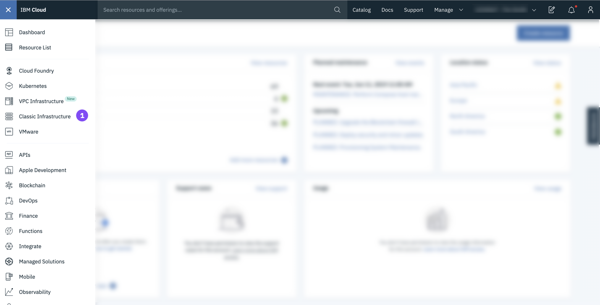
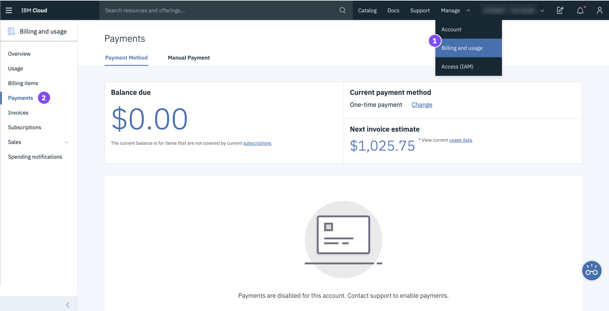
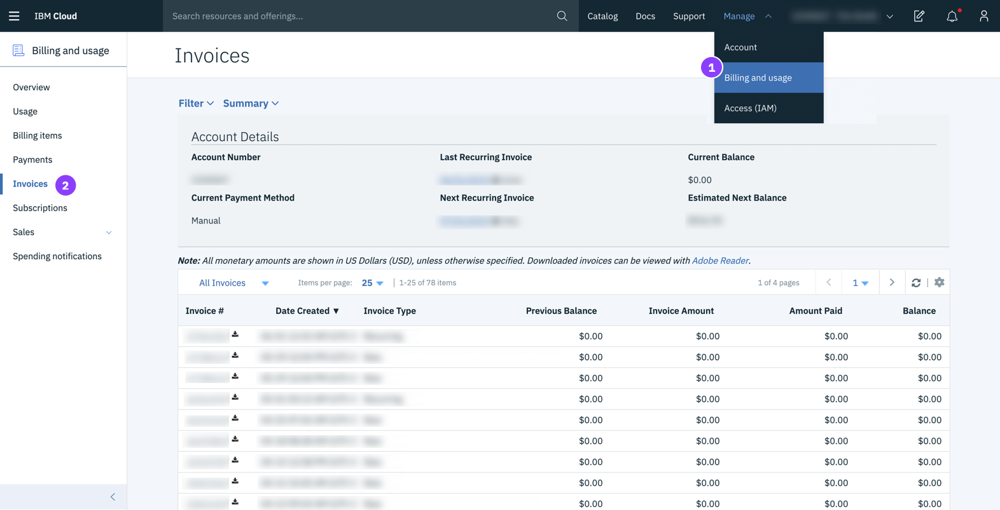
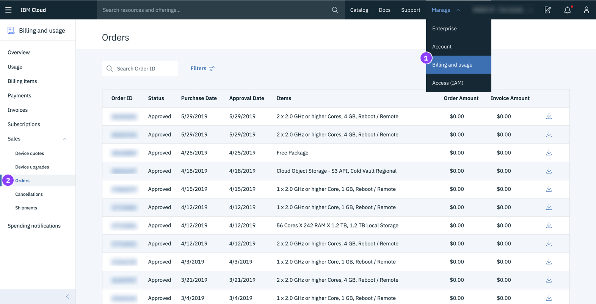
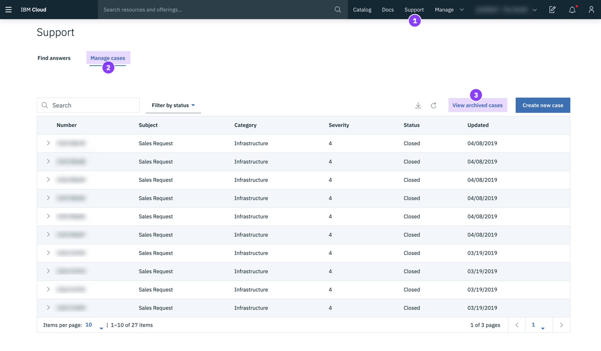

---

copyright:
  years: 2015, 2021
lastupdated: "2021-03-12"

keywords: ui, components, using the console, SoftLayer, classic infrastructure, redirect, catalog, pricing information, get support, dashboard, scoped dashboard

subcollection: overview

---

{:shortdesc: .shortdesc}
{:tip: .tip}
{:note: .note}
{:external: target="_blank" .external}
{:video: .video}

# Navigating the {{site.data.keyword.cloud_notm}} console 
{: #ui}

The [{{site.data.keyword.cloud}} console](https://cloud.ibm.com){: external} is a user interface that you use to manage all your {{site.data.keyword.cloud_notm}} resources. You can create a free account, log in, access documentation, access the catalog, view pricing information, get support, or check the status of {{site.data.keyword.cloud_notm}} components. After you log in, the menu bar contains a **Menu** icon  and more links.
{: shortdesc}

## Watch a tour
{: #video-ui}

{: video output="iframe" data-script="#video-transcript-ui" id="youtubeplayer" frameborder="0" webkitallowfullscreen mozallowfullscreen allowfullscreen}

### Video transcript
{: #video-transcript-ui}
{: notoc}

Welcome to {{site.data.keyword.cloud_notm}}, your open, secure, and enterprise-ready cloud platform with over 350 unique products for you to start building the solutions that you need today! Just log in, and you're ready to start building in the cloud.

From the global navigation, you can explore how to get started with key technologies in {{site.data.keyword.cloud_notm}}. Choose from technologies including serverless computing with Functions [Click Menu icon > Functions], container-based deployments on Kubernetes [Click Kubernetes to expand the options] or Red Hat OpenShift [Click OpenShift to expand the options], and VPC infrastructure [Click VPC Infrastructure to expand the options]. Developers can start with API management tools, app development starter kits, DevOps toolchains, and more to expedite and automate your app development. 

You can get started creating resources through any of these guided journeys [Click Kubernetes > Clusters]. 

Or, if you want to explore everything that {{site.data.keyword.cloud_notm}} has to offer, go to the catalog to browse over 350 unique products [Click Catalog menu item]. Choose from our broad portfolio of managed services [Click Services], explore software products to take advantage of simplified installation [Click Software], or consult with {{site.data.keyword.cloud_notm}} experts [Click Consulting]. If you're just here to try it out, filter the catalog by products that offer Lite plans, which are free to use [Click Services, and select the Lite pricing plan option]. 

When you're working in {{site.data.keyword.cloud_notm}} [Click IBM Cloud menu option], check out your dashboard to get a high-level overview of your account's resources, users, support cases, compliance monitoring, and usage, with quick links out to each area. You can tailor the information that's displayed to only what you need by creating custom dashboards and adding widgets for specific resources, team notes, management tasks, and more [Click the Actions menu icon > Create dashboard > Management > Create]. 

For any account management tasks that you need to take care of, go to Manage > Account [Click Manage menu option > Account]. Here you can create and manage your resource groups, Cloud Foundry orgs, create tags to organize resources, manage your account settings, and more. 

From the same Manage menu, you can go to Billing and usage [Click Manage menu option > Billing and usage] to view your usage, view invoices, and set spending notifications to help keep track of your costs.

Then, through the Manage > Access (IAM) option [Click Manage menu item > Access (IAM)], you can invite users to your account and manage their access to account resources including IAM-enabled, Cloud Foundry, and classic infrastructure resources. 

In a connected world, security is more important than ever, and we've built it right into the platform [Click Menu icon > Security and Compliance]. With the {{site.data.keyword.cloud_notm}} Security and Compliance Center [Click Dashboard], you can set up a unified dashboard to monitor security and compliance, govern configuration, and gain insights into threats. 

If you prefer to work from the command line [Click IBM Cloud Shell menu item], you can manage your {{site.data.keyword.cloud_notm}} account and resources right from your browser with {{site.data.keyword.cloud-shell_notm}}. Just open {{site.data.keyword.cloud-shell_short}} to start using the {{site.data.keyword.cloud_notm}} CLI and tons of other plug-ins, tools, and runtimes with no installation needed. 

If you run into any questions as you're working in {{site.data.keyword.cloud_notm}}, visit the Support Center [Click Support menu option], where you'll find FAQs and common tasks that can help you to resolve your issue quickly without even having to contact {{site.data.keyword.cloud_notm}}. However, if you do need to get in touch with us or open a support case, those options are also available to you. 

For in-depth information about how to get up and running in {{site.data.keyword.cloud_notm}}, visit the docs [Click Docs menu item > Develop tab]. Explore key topics by use case or browse through our library of tutorials that range from quick start guides to advanced solution tutorials [Click Deploy tab > Tutorials tab].

For more guidance, check out the full product docs [Click All product docs tab] or API & SDK reference libraries [Click API & SDK reference tab]. Or, browse our FAQ library to get answers to common questions about {{site.data.keyword.cloud_notm}}'s products and services [Click FAQs tab, and expand the What is Master Data Management? entry]. 

Now that you know how to navigate through the {{site.data.keyword.cloud_notm}} user interface to get your account set up, create resources from the catalog, and find help through support and docs, it's time get coding or building your infrastructure!

## Using the console
{: #consoleoptions}

When you log in to {{site.data.keyword.cloud_notm}}, your dashboard is displayed, which shows widgets that summarize the status of your account. If you're interested in customizing your dashboard, see [Working with scoped dashboards](/docs/account?topic=account-custom-dashboard).

  * Use the **Catalog** link to explore over 350 products that offer options for compute, networking, security management, end-to-end developer solutions, and more.
  * Use the **Docs** link to access the product documentation. 
  * Use the **Support** link to access the Support Center.  
  * From the **Manage** menu, you can access your account, billing and usage, and Identity and Access Management options.
  * Click the {{site.data.keyword.cloud-shell_notm}} icon  to open a browser-based shell environment that you can use to work with your {{site.data.keyword.cloud_notm}} resources.
  * Click the Cost estimator icon  to open the cost estimator.
  * Click the Notifications icon  to view and control all incidents, maintenance, and announcements that are likely to affect your account.
  
## Working in the catalog
{: #catalogcreate}

Click **Catalog** from the console menu bar to explore the available offerings, which are organized in the following categories: 

* From the Services tab, you can explore the {{site.data.keyword.cloud_notm}} services for infrastructure, developer tools, compute, AI, and more for building your apps on the public cloud. The lifecycle and operations of these services are managed by {{site.data.keyword.IBM_notm}}.
* From the Software tab, you can find Cloud Paks, Bitnami Helm charts, and Terraform templates. The preconfigured software solutions help you to build faster, and each offering is installed by using a simplified installation process to help you get started quickly. You manage the deployment and configuration of these offerings on your own compute resources.

You can quickly search for any specific offering by entering keywords, or you can use the categories and filters to explore the different types of offerings. You can filter by category, offering type, deployment target, or the offering provider. For example, if you want to deploy an analytics offering to {{site.data.keyword.openshiftlong}}, you can select the **Analytics** category, and then filter the results by selecting **Red Hat OpenShift** as the deployment target.

After you select the offering that you want to create, you can define the deployment location.

  * For Cloud Foundry resources, you can select a specific region and then select the org and space for the service instance to be assigned to.
  * For resources managed by {{site.data.keyword.cloud_notm}} Identity and Access Management (IAM), you select a location to deploy in. Then, you select a resource group to assign the service instance to.

## Searching for resources
{: #search}

You can search for resources by name or by tag from anywhere in the {{site.data.keyword.cloud_notm}} console for resources that you expect to find in your resource list. Type the name of a resource or tag in the search field in the console menu bar.

For more information, see [Searching for resources](/docs/account?topic=account-searching-for-resources). 

## Managing resources
{: #dashboardview}

Go to the Menu icon  &gt; **Resource List** to access your list of account resources. You can use the Resource list page to view and work with {{site.data.keyword.cloud_notm}} resources and Cloud Foundry service instances. 

### Viewing resources
You can view all the resources in your account across all locations from your resource list. To see the items that are important to you, filter your list with the filters for each column header. For example, if you want to view and work with resources in a specific location, expand the **Location** filter, and select a location from the list.

### Working with resources
You can work with your resources in various ways from your resource list:

  * Each resource is displayed in its own row and an Actions icon  is included at the end of the row. Click the Actions icon  to start, stop, rename, or delete a resource.
  * To set up credentials or connections for a resource, click the name of the resource to go to the resource details page. Then, select **Service credentials** or **Connections**. For more information, see [Adding a credential](/docs/account?topic=account-service_credentials) and [Managing connections](/docs/account?topic=account-connect_app).

## Transitioning to the {{site.data.keyword.cloud_notm}} experience
{: #redirect-cloud}

As part of the migration from SoftLayer to {{site.data.keyword.cloud_notm}}, get familiar with the {{site.data.keyword.cloud_notm}} console, which you use to manage both your platform and infrastructure resources. We're currently linking all SoftLayer and {{site.data.keyword.cloud_notm}} accounts. Therefore, your account might not have access yet. As soon as it does, you can check out the new experience.

The formerly named SoftLayer is now called {{site.data.keyword.cloud_notm}} classic infrastructure.
{: note}

### Locating your infrastructure items
{: #sl-links}

Click the **Menu** icon  > **Classic Infrastructure** to quickly locate your devices, storage, network, security, and services. 

{: caption="Figure 1. Location of classic infrastructure items in the {{site.data.keyword.cloud_notm}} console" caption-side="bottom"}

You can also find your infrastructure resources by clicking any of the links that are listed in the Classic infrastructure widget on your dashboard. Go to **Menu** icon  > **Dashboard**.
{: tip}

### Managing users, access, and API keys
{: #billing-items}

You can manage users in your account, classic infrastructure access for your users, and your API keys from the Access (IAM) section of the console. 

* To invite new users, remove users, or manage a specific user's login settings, IP restrictions, VPN password, and more, go to **Manage** > **Access (IAM)**, and select **Users**.
* To start managing a user's classic infrastructure access, go to **Manage** > **Access (IAM)**, and select **Users**. For more information, see [Managing classic infrastructure access](/docs/account?topic=account-mngclassicinfra).
* To create and manage {{site.data.keyword.cloud_notm}} API keys or a classic infrastructure API key, go to **Manage** > **Access (IAM)**, and select **API keys**. For more information, see [Understanding API keys](/docs/account?topic=account-manapikey).

{: caption="Figure 2. Managing IAM items in the {{site.data.keyword.cloud_notm}} console" caption-side="bottom"}

### Placing an order
{: #place-order}

Use the catalog to place an order. You can navigate to the catalog in one of the following ways:

  * Click **Catalog** from the menu bar.
  * Click the **Menu** icon  > **Resource list**. Then, click **Create resource**.

{: caption="Figure 3. Placing an order in the {{site.data.keyword.cloud_notm}} console" caption-side="bottom"}

If your account includes any discounts, the price of an offering that is displayed on the offering details page reflects the discounted price of that offering.
{: tip}

### Making a payment
{: #payments}

You can make a payment from the Billing and usage section of the console. Go to **Manage** > **Billing and usage**, and select **Payments**. 

{: caption="Figure 4. Making a payment in the {{site.data.keyword.cloud_notm}} console" caption-side="bottom"}

### Accessing your invoices
{: #invoices}

You can access your invoices from the Billing and usage section of the console. Go to **Manage** > **Billing and usage**, and select **Invoices**.

{: caption="Figure 5. Accessing your invoices in the {{site.data.keyword.cloud_notm}} console" caption-side="bottom"}

### Accessing your sales items
{: #sales}

Your device quotes and upgrades, orders, cancellations, and shipments are in the Billing and usage section of the console. Go to **Manage** > **Billing and usage**, and select **Sales**. 

{: caption="Figure 6. Accessing your sales items in the {{site.data.keyword.cloud_notm}} console" caption-side="bottom"}

### Accessing your support cases
{: #support-mng}

To access your current support cases, click **Support** > **Manage cases**. You can also access your archived cases by clicking **View archived cases**.

{: caption="Figure 7. Accessing your support cases in the {{site.data.keyword.cloud_notm}} console" caption-side="bottom"}

### Submitting feedback
{: #feedback-profile}

You can submit a rave review, a suggestion, or any other feedback. To get in touch with us, choose from the following methods:

  * Click the **Feedback** button that is on the edge of the console page. 
  * Click the **Avatar** icon  > **Feedback**. 

{: caption="Figure 8. Submitting feedback in the {{site.data.keyword.cloud_notm}} console" caption-side="bottom"}

### Setting email preferences
{: #email-prefsl}

You can set your preferences to receive emails about platform and infrastructure notifications. Click the **Avatar** icon  > **Profile and settings**, and select **Notifications**.

{: caption="Figure 9. Setting your email preferences in the {{site.data.keyword.cloud_notm}} console" caption-side="bottom"}

### Selecting your VPN access point
{: #vpn-access}

You can log in to the {{site.data.keyword.cloud_notm}} console by using a VPN access point. Go to [VPN access](https://www.ibm.com/cloud/vpn-access), and select an access point from the lists.
